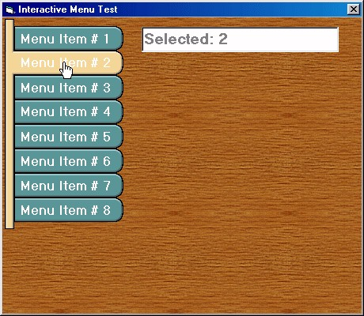



## Interactive Menu \(like Flash\)

### Description

Interactive menu similar to the ones built with Flash/Swish. Image changes when mouse over menu item and sound effect plays (using API call) for Button Over and Pressed events. No OCX's and DLL's used in this snippet of code. Pure VB. You can change menu image to whatever you want, but you will have to modify the coordinates in the lblMenu_MouseMove sub for the imgMenuOn content. Please vote if you find this useful. Comments are welcomed. Enjoy!
 
### More Info
 

             |
---                |---
**Submitted On**   |2002-05-14 08:58:12
**By**             |[Gilmet](https://github.com/Planet-Source-Code/PSCIndex/blob/master/ByAuthor/gilmet.md)
**Level**          |Beginner
**User Rating**    |4.3 (34 globes from 8 users)
**Compatibility**  |VB 6\.0
**Category**       |[Graphics](https://github.com/Planet-Source-Code/PSCIndex/blob/master/ByCategory/graphics__1-46.md)
**World**          |[Visual Basic](https://github.com/Planet-Source-Code/PSCIndex/blob/master/ByWorld/visual-basic.md)
**Archive File**   |[Interactiv829595142002\.zip](https://github.com/Planet-Source-Code/gilmet-interactive-menu-like-flash__1-34779/archive/master.zip)

